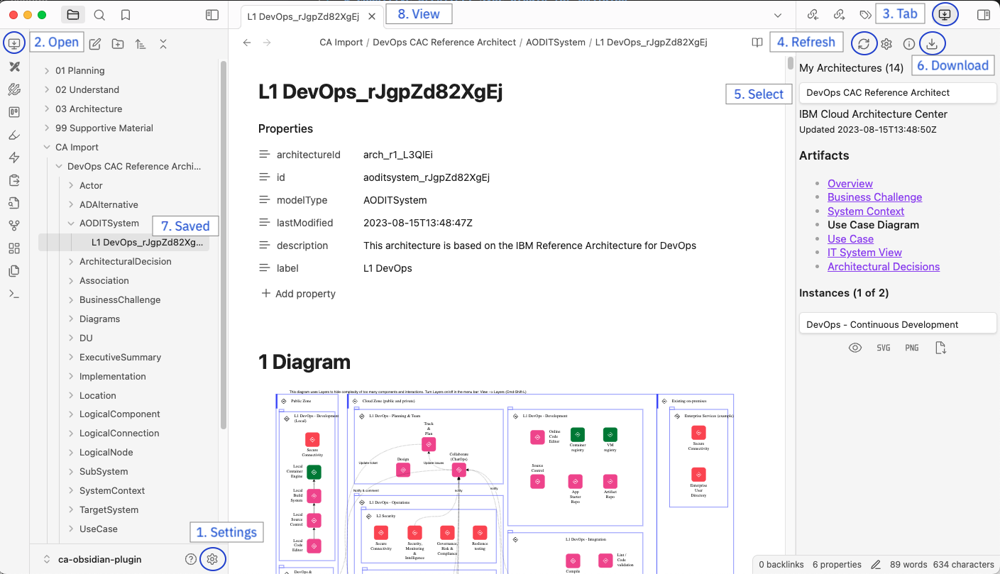

# Cognitive Architect Sync plugin for Obsidian

This Obsidian plugin enables downloading of architectures from Cognitive Architect (aka [IBM IT Architect Assistant](https://it.architect-assistant.ibm.com/)) into Obsidian as notes and images. It does require a Personal Token from the Cognitive Architect support team.

## What does it do?

Cognitive Architect is an architecture modeling tool. [Obsidian](https://obsidian.md/) is a writing app that enables linking of information (notes). It is highly extensible by plugins.<p/>
This plugin creates Notes in Obsidian of the architectural artifacts from Cognitive Architect. Using the Linking functionality of Obsidian, these Notes can be linked together and combined with other information. The vast Obsidian community plugin ecosystem allows for the integraton of other tools (mindmaps, Excalidraw, drawio, etc.) and functionality (like creating custom views with the Data View plugin). Obsidian Notes are stored locally on the computer in Markdown format.

# How to use

-   Install the plugin from Obsidian: Settings -> Community Plugins -> Browse plugins -> search for "Cognitive Architect Sync" -> Install Plugin.
-   Enable the plugin.
-   In the plugin Settings (1, see screenshot below) enter the Base URL and the Personal Token (contact support for a Personal Token)
-   In the sidebar on the left (the ribbon) click the icon (2) of this plugin (a computer monitor with down pointing arrow).
-   The plugin is available on the right in the sidepanel (3)
-   Get a list of your architectures by selecting Refresh (4)
-   Select an architecture (5)
-   Select an artifacts and its instances, or download all artifacts at once (6)
-   The saved artifacts are shown in the File browser on the left (7)
-   View the artifacts by selecting them in the File browser (8)



## Works better with

The plugin works better when the following plugins are installed and enabled.

-   the Obsdian built-in [Templates](https://help.obsidian.md/Plugins/Templates) functionality<br/>
    Templates define the formating of artificats in Obsdian notes. If no template is provided, a default format is chosen.
-   the Community [Dataview plugin](https://blacksmithgu.github.io/obsidian-dataview/).<br/>
    Enabled the creation of views in your notes (for example a list of requirements associated with an artifact)

To develop your own templates and views see the [Obsidian Example Vault for Dataview Queries](https://github.com/s-blu/obsidian_dataview_example_vault) for examples.

# Features

-   Download architecture artifacts and save into Markdown format with frontmatter properties
-   Link artificats in notes and use Data View plugin to create customized views.

# Development setup

Feel free to improve this plugin.

## About

This plugin uses JavaScript, [Typescript](https://www.typescriptlang.org/) and [Svelte](https://svelte.dev/).
It is based on the [Obsidian-Svelte-Starter](https://github.com/Quorafind/Obsidian-Svelte-Starter) template.
[Obsidian Plugin Developer](https://docs.obsidian.md/) documentation.

## Setup

```bash
# for local development
npm install
npm run dev
// Or yarn dev

# for a production bundle
npm install
npm run build
// Or yarn build
```

## Upload new version to Obsidian plugin registry

See [Obsidian's instructions](https://docs.obsidian.md/Plugins/Releasing/Submit+your+plugin).

1. Update version in manifest.json (and package.json)
2. Build the plugin
   `npm run build`
3. Add the changes to repo

```
git add .
git commit -m "description of changes"
git push
```

4. create a release with a tag with the same version: https://github.com/bhavers/obsidian-ca/releases/

-   Add manifest.json, main.js and styles.css and Publish release

## Description of files

| File                                                                         | Description                                                                              |
| ---------------------------------------------------------------------------- | ---------------------------------------------------------------------------------------- |
| manifest.json                                                                | The [Obsidian Manifest](https://docs.obsidian.md/Reference/Manifest).                    |
| starterIndex.ts                                                              | The starting point (extension of Plugin class)                                           |
| src/CASettings.ts                                                            | Settings menu                                                                            |
| src/CAView.ts and CAViewComponent.svelte                                     | The main view (in the sidebar) of this plugin                                            |
| src/CAArchInfoModal.ts and<br/> CAArchInfoModalComponent                     | The Architecture Information dialog (that pops up after selecting the Information icon)  |
| src/ModalPreviewInstance.ts and<br/> ModalPreviewInstanceComponent           | Dialog with a preview of the artificat (pops up after clicking the Preview icon)         |
| lib/ca.ts                                                                    | The main logic to fetch data from Cognitive Architect                                    |
| lib/ca-obsidian.ts                                                           | Bridge between ca.ts (that retrieves artifact data) and Obsidian (storing data as notes) |
| lib/stores.ts                                                                | [Svelte Stores](https://svelte.dev/docs/svelte-store) and type definitions               |
| lib/ca-openapi.json, ca-schema.d.ts and<br/> ca-schemaListArchitectures.d.ts | Typescript schema definitions generated from the Cognitive Architect OpenAPI definition  |
| lib/progress.ts                                                              | Progress bar component (used in CAView)                                                  |

```

```
